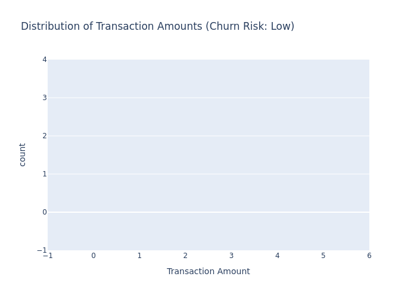

## Data Analytics and Business Intelligence (BI)

### Overview

In this demo, we analyze customer transaction patterns and create interactive dashboards.

### Static Visualization



*Figure 1: Distribution of Average Transaction Amount per Customer*

### Interactive Visualization

[Churn Risk Group Distribution](visualizations/dashboard_interactive.html)

*Interactive visualization showing the distribution of churn risk groups.*

# Instructions


# Modified dashboard.py Script
Install Additional Libraries: Ensure you have plotly and dash installed in your environment. You also need selenium and Pillow for saving HTML and PNG files.
bash


Copy code

   pip install dash plotly selenium pillow
   
Modify the Script: Update dashboard.py to include code that generates and saves the 

# Steps to Fix the Error
## Install kaleido: Run the following command to install the kaleido package:
bash
# Copy code

  pip install -U kaleido

Update Your Script: Ensure your script uses kaleido for image export. The plotly library should automatically use kaleido once it is installed.
Verify the Installation: After installing kaleido, re-run your script to ensure it works correctly.
## How to Push Changes to GitHub from Codespace
Save the Script: Copy the above code into a file named dashboard.py inside the data_analytics_bi/code/ directory of your GitHub repository.
Install Dependencies: Make sure you have the necessary Python packages installed. You can install them using pip:
bash
Copy code
   
   
   pip install pandas dash plotly

   
Run the Script: Execute the script from your terminal or command line:
bash

Copy code

   python data_analytics_bi/code/dashboard.py
   
View the Dashboard: Open your web browser and go to http://127.0.0.1:8050/ to view the interactive dashboard.
This script leverages Dash and Plotly to create an interactive dashboard that allows users to filter data based on the churn risk and view visualizations accordingly. It’s a powerful tool for exploring and presenting data insights directly from your GitHub Codespace.


Follow these steps to push your changes to GitHub from Codespace:

### 1. Check the Status of Your Repository

First, open the terminal in your Codespace and check the current status of your repository to see what changes have been made:

```bash

git status

### 2. Add Your Changes
Add the files you want to commit to your repository. You can add all changes or specify particular files:

To add all changes:
bash
Copy code


   git add .

To add specific files:
bash
Copy code
git add path/to/your/file

### 3. Commit Your Changes
Once you've staged the changes, commit them with a descriptive message:

bash
Copy code


git commit -m "Add dashboard images to visualizations directory"


### 4. Pull the Latest Changes (Optional but Recommended)
Before pushing, it's a good idea to pull the latest changes from the remote repository to ensure that your local branch is up to date:

bash
Copy code
git pull origin main
Replace main with the appropriate branch name if you are working on a different branch.

### 5. Push Your Changes to GitHub
Now push your committed changes to the remote repository:

bash
Copy code

git push origin main

Replace main with the branch you are working on if it's not the main branch.

### 6. Verify the Push
After pushing, you can verify that your changes have been successfully pushed by checking your GitHub repository on the GitHub website.

If you encounter any issues during these steps, please let me know the specific error message, and I can help troubleshoot!
